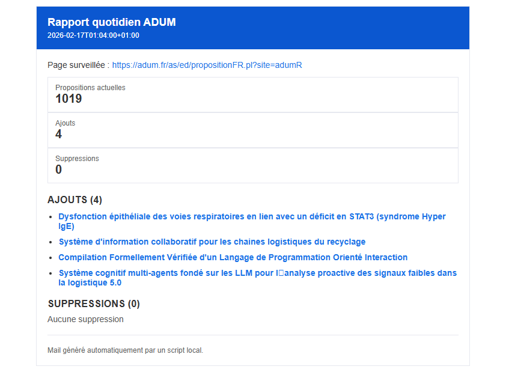

# ADUM Thesis Watcher

## Objectif du projet

Ce projet permet de **suivre automatiquement les nouvelles offres de thèse publiées sur ADUM**.

Le script :

* consulte la page des propositions ADUM
* détecte les nouvelles offres par rapport à la veille
* envoie un **email** avec le résumé des changements
* fournit des **liens cliquables** vers chaque offre

But : éviter de vérifier le site manuellement chaque jour et ne rater aucune nouvelle proposition.

---

## Installation

### 1- Cloner le projet

```bash
git clone <repo>
cd <repo>
```

### 2- Créer un environnement virtuel

```bash
#Création
python -m venv venv    

#Activation
source venv/bin/activate        # macOS / Linux
venv\Scripts\activate           # Windows
```

### 3- Installer les dépendances

```bash
pip install -r requirements.txt
```

### 4- Configurer l’email

Créer un fichier `.env` à la racine du projet :

```env
SMTP_HOST=smtp.orange.fr
SMTP_PORT=587
SMTP_USER=votre_mail@orange.fr
SMTP_PASS=votre_mot_de_passe
MAIL_FROM=votre_mail@orange.fr
MAIL_TO=votre_mail@orange.fr
```

### 5- Lancer le script

```bash
python watch_adum.py
```

Un email de rapport sera envoyé à chaque exécution.

---

## Aperçu du mail


<p align="center">
  
</p>
